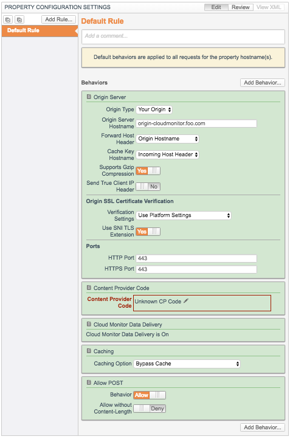
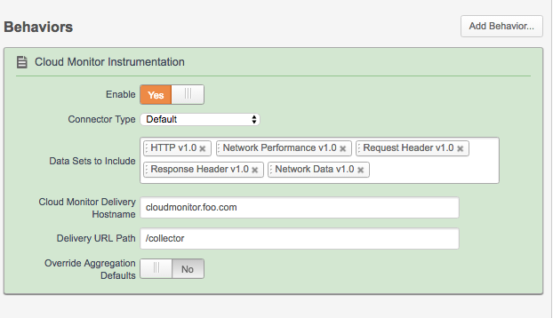
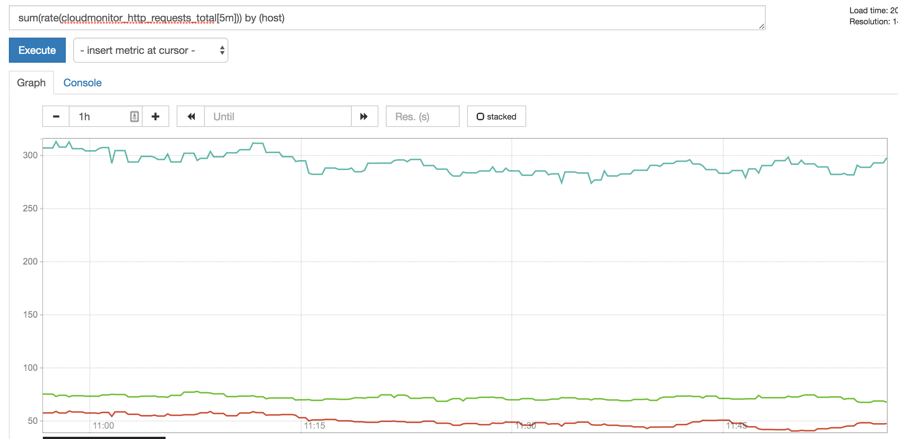
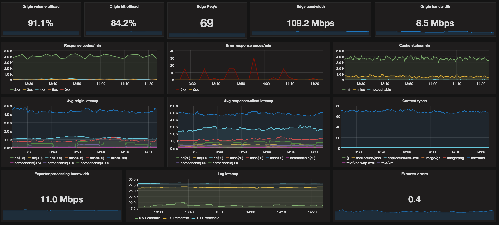

# Cloudmonitor exporter
Prometheus exporter for Akamai Cloudmonitor statistics.
Retrieves json data from akamai cloudmonitor (https://control.akamai.com/dl/customers/ALTA/Cloud-Monitor-Implementation.pdf) on `collector.endpoint` and provides metrics on `metrics.endpoint`

## Get it
The latest version can be found under [Releases](https://github.com/ExpressenAB/cloudmonitor_exporter/releases).

## Usage
Example: 
```
./cloudmonitor_exporter
```

## Flags
Flag | Description | Default
-----|-------------|---------
-exporter.address | Exporter bind address:port | :9143
-exporter.namespace | The namespace used in prometheus labels | cloudmonitor
-metrics.endpoint | Metrics endpoint | /metrics
-collector.endpoint | Collector endpoint | /collector
-collector.accesslog | File to store accesslogs to | "" off

## Setup
To be able to retrieve cloudmonitor data to the running exporter, you need to to create an cloudmonitor property, that other properties will send loglines to.
Detailed information can be found [Here](https://control.akamai.com/dl/customers/ALTA/Cloud-Monitor-Implementation.pdf)

For example:



Then it's enough to add the following behavior to your properties.



When properties are active and data is retrieved we will be able to query prometheus.



An example of metrics used on grafana dashboard



