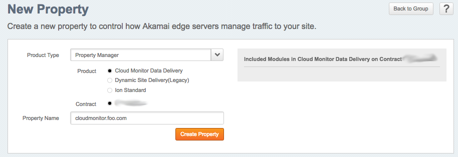
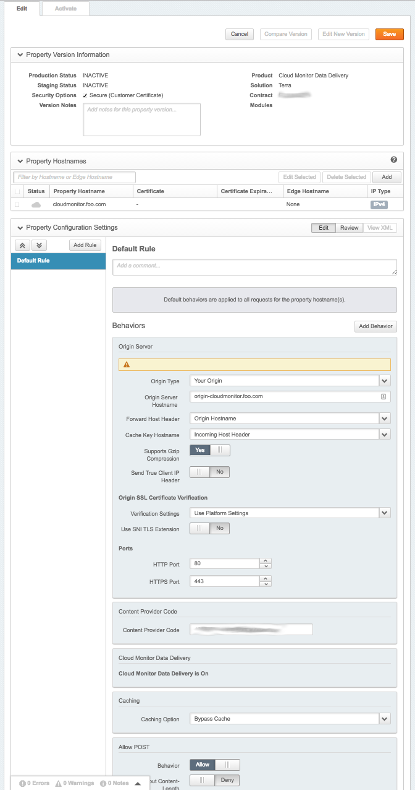
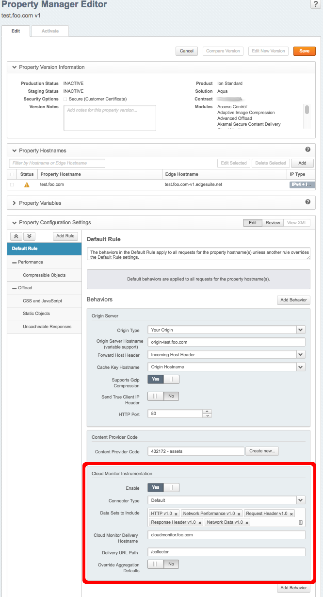
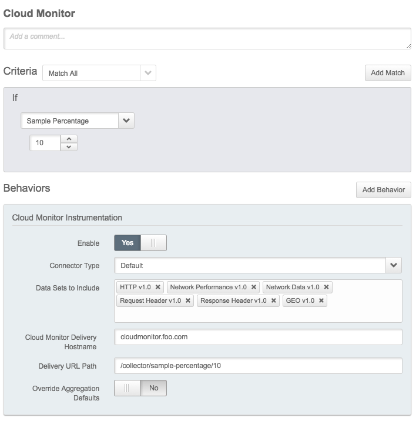

# Akamai setup

To be able to retrieve data from akamai we need to perform the following steps:
* Create an cloudmonitor property
* Add an cloudmonitor behavior to every property you want to export data from

## Cloudmonitor property

In the cloudmonitor property we define to which endpoint you want to send the data.
(More detailed instruction can be found at [Akamai site](https://control.akamai.com/dl/customers/ALTA/Cloud-Monitor-Implementation.pdf))

Create an property of the type "Cloud monitor data delivery"

Basic settings of an cloudmonitor property:

## Site property

To enable cloudmonitor on your site properties, just add cloudmonitor behavior with correct parameters.

## Sampling of Cloudmonitor data

On a very busy property, it might not be necessary with very detailed data, since it will result in a high log bandwith and associated costs. If you are willing to accept some inaccuracy, you can enable sampling of cloudmonitor data. This is done in two steps:
* Set a criteria on the Cloudmonitor rule
* Set a matching sample rate as a parameter in the delivery url path on the Cloudmonitor behavior

